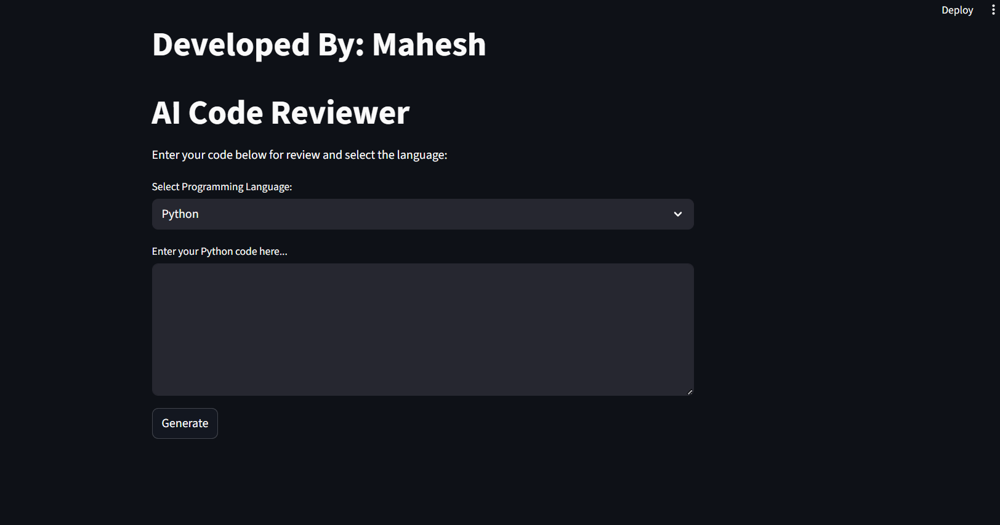

# 🤖 AI Code Reviewer

A Python-based AI-powered code review tool built with **Streamlit** and **Google Generative AI** 
This tool helps developers analyze Python code by identifying bugs, suggesting improvements,
and enhancing overall code quality in real-time.

## 🚀 Features

- 🧠 **AI-Powered Review**: Uses Google's Gemini Pro to review Python code intelligently.
- 🐞 **Bug Detection**: Detects potential issues and logical errors in the code.
- ✨ **Code Suggestions**: Provides recommendations for code enhancement and optimization.
- 🖥️ **User-Friendly Interface**: Built using Streamlit for an intuitive and interactive user experience.
- 📂 **Support for Code Files**: Users can input code directly or upload `.py` files for review.

---

## 📸 Demo

  

---

## 🛠️ Tech Stack

- **Frontend**: Streamlit
- **Backend**: Python
- **AI Integration**: Google Generative AI (Gemini Pro)
- **APIs**: Google Generative AI API (via `google.generativeai`)

---

## 📦 Installation

```bash
# Clone the repository
git clone https://github.com/mahesh091215/Ai_code_review.git

cd Ai_code_review


# Create a virtual environment (optional but recommended)
python -m venv venv
source venv/bin/activate  # On Windows: venv\Scripts\activate

# Install required packages
pip install -r requirements.txt

🔑 Setup API Key
Go to Google AI Studio.

Get your API key.

Create a .env file in the project root and add:

GOOGLE_API_KEY=your_api_key_here
Make sure not to expose your API key in public repositories.

▶️ Run the App
streamlit run app.py

📁 File Structure

AI-Code-Reviewer/
│
├── app.py                # Main Streamlit app
├── ai.py                 # Handles AI review logic
├── style.css             # Custom CSS styling
├── requirements.txt      # Python dependencies
├── .env                  # Environment variables (not pushed)
└── README.md             # Project documentation

🌟 How It Works
Paste your Python code or upload a .py file.

Click "Analyze".

The app sends your code to Gemini Pro.

The AI returns a detailed review with bug detection and suggestions.

All results are displayed clearly in the UI.

📚 Example Use Case
def add(a, b):
return a+b

🧠 AI Output:

"IndentationError: expected an indented block. Consider adding proper indentation after the function definition."


